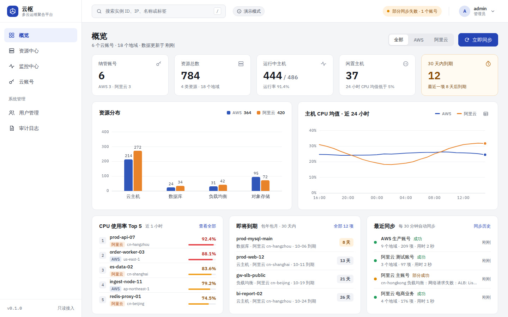
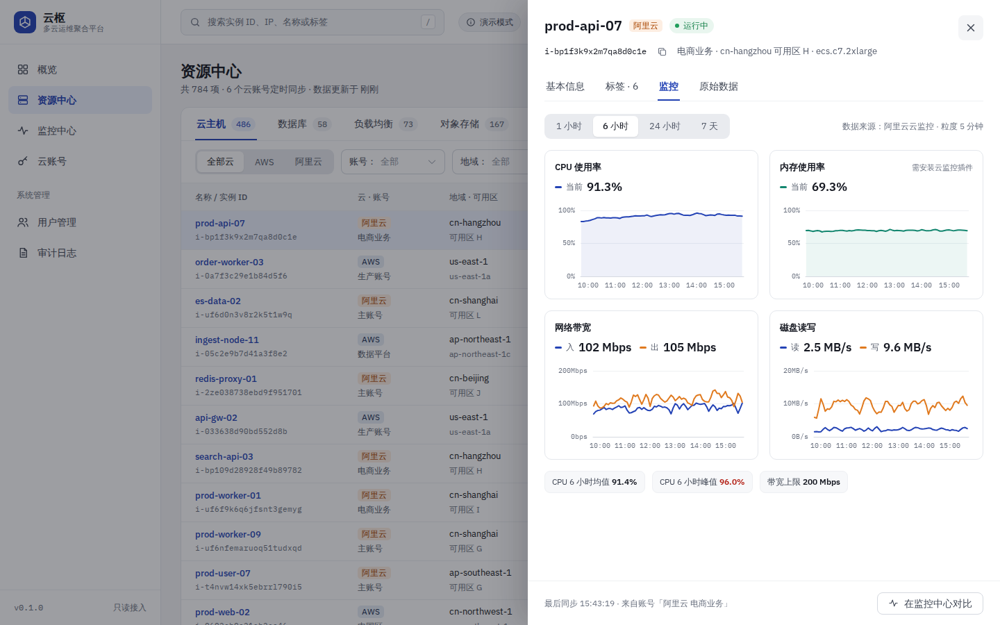
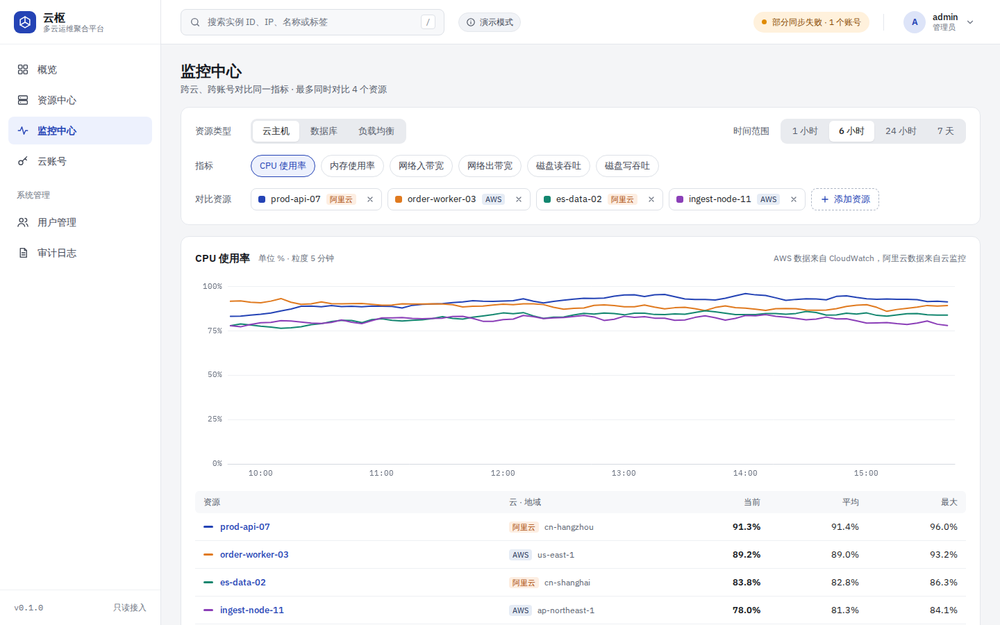
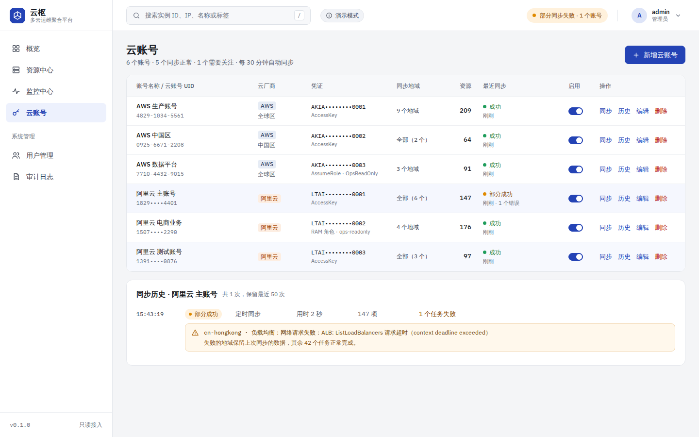
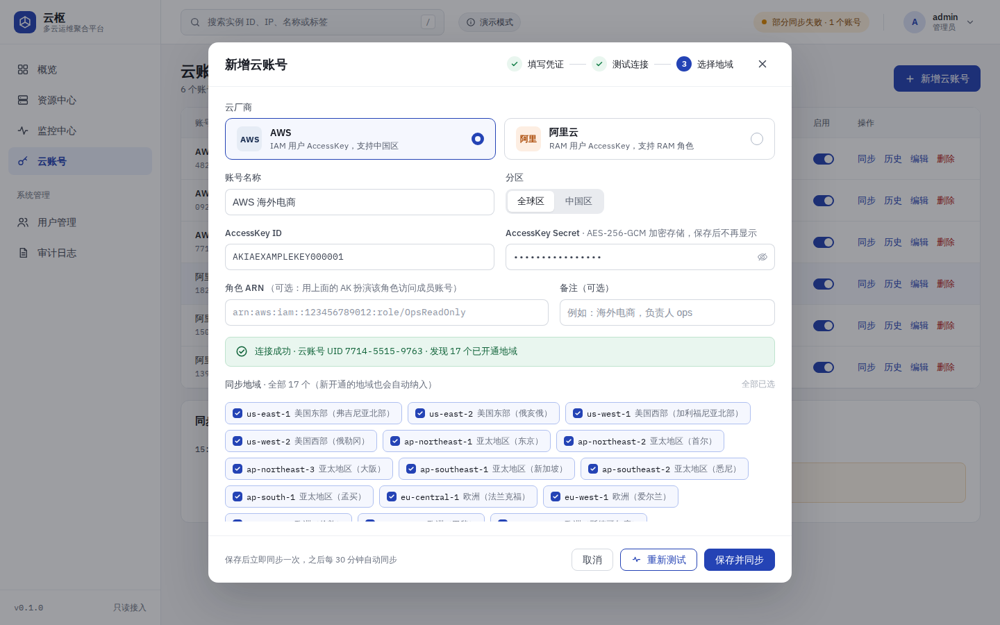

# 云枢 · AWS 与阿里云运维聚合平台

把多个 AWS、阿里云账号的资源和监控收拢到一个界面：统一资源清单、跨云监控对比、到期与闲置提醒。后端 Go，前端 Vue 3 + Element Plus，编译成**单个二进制**，内置 SQLite，下载即可运行。



## 功能

| 模块 | 说明 |
|---|---|
| 云账号 | 纳管多个 AWS（全球区 / 中国区）和阿里云账号；支持 AccessKey 直连，或 AssumeRole / RAM 角色访问成员账号。保存前自动测试连接、发现已开通地域，可只同步部分地域。 |
| 资源中心 | 云主机（EC2 / ECS）、数据库（RDS）、负载均衡（ALB / NLB / CLB / 阿里云 ALB）、对象存储（S3 / OSS）四类资源统一展示；按云、账号、地域、状态筛选，按名称、ID、IP 或标签（`env:prod`）搜索；详情抽屉里看配置、标签、监控曲线和原始数据。 |
| 监控 | 实时查询 CloudWatch 与阿里云云监控，指标统一换算单位；资源详情里看 CPU、内存、网络、磁盘、对象存储容量与请求等曲线；监控中心可跨云、跨账号同时对比最多 4 个资源。 |
| 概览 | 资源总数、运行率、闲置主机（24 小时 CPU 均值低于 5%）、30 天内到期的包年包月资源、分云的 CPU 均值曲线、CPU Top 5、最近同步结果。 |
| 同步 | 定时（默认 30 分钟）+ 手动同步，可查看进度和取消；单个地域失败不影响其他地域，失败的地域保留上次数据；每次同步的错误明细可追溯。 |
| 用户与审计 | 管理员 / 只读两种角色；登录失败锁定；登录、云账号变更、手动同步、用户管理全部记审计日志。 |

只调用云厂商的**只读 API**，平台不会创建、修改或删除任何云资源。

## 快速开始

### 演示模式（不需要云账号）

演示模式用生成的数据模拟 6 个云账号、784 项资源和监控曲线，可以完整体验所有页面：

```bash
make demo                      # 构建并以演示模式启动
# 或者使用已构建的二进制
OPS_DEMO=true OPS_ADMIN_PASSWORD='Admin12345' ./bin/go-aws-aliyun
```

浏览器打开 <http://localhost:8080>，用户名 `admin`。没有设置 `OPS_ADMIN_PASSWORD` 时，初始密码会随机生成并打印在启动日志里。

### 从源码构建

需要 Go 1.26+（本地版本较低时会通过 `GOTOOLCHAIN` 自动下载）和 Node.js 22.12+。

```bash
make build          # 构建前端并编译 bin/go-aws-aliyun（前端通过 go:embed 打包进二进制）
./bin/go-aws-aliyun # 默认监听 :8080，数据写入 ./data
```

常用命令：

| 命令 | 说明 |
|---|---|
| `make build` | 构建前端 + 编译二进制 |
| `make demo` | 以演示模式运行 |
| `make dev` | 开发模式：后端演示模式跑在 :8080，Vite 开发服务器跑在 :5173 并代理 `/api` |
| `make test` | 运行后端测试 |
| `make lint` | gofmt、go vet、前端类型检查 |
| `make docker` | 构建 Docker 镜像 |

### Docker

```bash
docker build -t yunshu:0.1.0 .
docker run -d --name yunshu -p 8080:8080 -v yunshu-data:/app/data yunshu:0.1.0
docker logs yunshu 2>&1 | grep password   # 查看随机生成的 admin 初始密码
```

镜像以非 root 用户运行，数据目录 `/app/data` 需要挂载持久卷。演示模式加 `-e OPS_DEMO=true`。

### 首次使用

1. 用 `admin` 登录，右上角菜单里修改密码。
2. 在「云账号」页新增账号：填写 AccessKey → 测试连接 → 选择地域 → 保存。保存后会立即同步一次。
3. 在「用户管理」为同事创建账号，只看不改的同事选「只读」角色。

## 云账号权限

建议为平台单独创建子账号，只授予只读权限。

### AWS（IAM）

最省事的方式是附加托管策略 `ReadOnlyAccess`。如果要最小授权，使用下面的策略：

```json
{
  "Version": "2012-10-17",
  "Statement": [
    {
      "Sid": "YunshuReadOnly",
      "Effect": "Allow",
      "Action": [
        "ec2:DescribeRegions",
        "ec2:DescribeInstances",
        "ec2:DescribeInstanceTypes",
        "ec2:DescribeVolumes",
        "ec2:DescribeAddresses",
        "rds:DescribeDBInstances",
        "elasticloadbalancing:DescribeLoadBalancers",
        "elasticloadbalancing:DescribeTags",
        "s3:ListAllMyBuckets",
        "cloudwatch:GetMetricData",
        "cloudwatch:ListMetrics"
      ],
      "Resource": "*"
    }
  ]
}
```

- 填写角色 ARN 时，AccessKey 所属用户还需要 `sts:AssumeRole` 权限，目标角色的信任策略要允许该用户扮演。
- 中国区（北京、宁夏）账号在新增时选择「中国区」分区。
- 内存指标需要在实例上安装 CloudWatch Agent（命名空间 `CWAgent`），否则内存曲线为空。

### 阿里云（RAM）

给 RAM 用户授予以下系统策略：`AliyunECSReadOnlyAccess`、`AliyunRDSReadOnlyAccess`、`AliyunSLBReadOnlyAccess`、`AliyunALBReadOnlyAccess`、`AliyunOSSReadOnlyAccess`、`AliyunCloudMonitorReadOnlyAccess`。

也可以只授予平台用到的接口：

```json
{
  "Version": "1",
  "Statement": [
    {
      "Effect": "Allow",
      "Action": [
        "ecs:DescribeRegions",
        "ecs:DescribeInstances",
        "ecs:DescribeDisks",
        "ecs:DescribeEipAddresses",
        "rds:DescribeDBInstances",
        "rds:DescribeDBInstanceAttribute",
        "slb:DescribeLoadBalancers",
        "slb:DescribeLoadBalancerAttribute",
        "alb:ListLoadBalancers",
        "oss:ListBuckets",
        "oss:GetBucketStat",
        "cms:DescribeMetricList"
      ],
      "Resource": "*"
    }
  ]
}
```

- 使用 RAM 角色时，RAM 用户还需要 `AliyunSTSAssumeRoleAccess`，角色的信任策略要允许该账号扮演。
- 内存指标需要在 ECS 上安装云监控插件。

## 配置

配置来源按优先级：环境变量 `OPS_*` > 配置文件 > 默认值。配置文件默认读取 `configs/config.yaml`（不存在时忽略），也可以用 `-config` 指定。完整说明见 [`configs/config.example.yaml`](configs/config.example.yaml)。

| 环境变量 | 默认值 | 说明 |
|---|---|---|
| `OPS_ADDR` | `:8080` | 监听地址 |
| `OPS_DATA_DIR` | `data` | 数据目录（SQLite、主密钥、JWT 密钥） |
| `OPS_ADMIN_PASSWORD` | 随机 | 初始管理员密码，只在首次创建 admin 时生效 |
| `OPS_MASTER_KEY` | 自动生成 | 加密 AccessKey Secret 的主密钥（base64 编码的 32 字节） |
| `OPS_JWT_SECRET` | 自动生成 | 登录令牌签名密钥 |
| `OPS_SYNC_INTERVAL` | `30m` | 定时同步间隔 |
| `OPS_SYNC_CONCURRENCY` | `8` | 同时执行的采集任务数 |
| `OPS_TOKEN_TTL` | `12h` | 登录有效期 |
| `OPS_AUDIT_RETENTION` | `180d` | 审计日志保留时长 |
| `OPS_DEMO` | `false` | 演示模式 |
| `OPS_LOG_LEVEL` / `OPS_LOG_FORMAT` | `info` / `text` | 日志级别和格式（`text` / `json`） |

**请备份数据目录**，尤其是 `master.key`：AccessKey Secret 用它加密（AES-256-GCM），丢失后只能重新录入所有云账号的 Secret。也可以用 `OPS_MASTER_KEY` 从密钥管理系统注入。

部署在 Nginx 等反向代理之后时，在配置文件的 `server.trusted_proxies` 里填写代理地址，审计日志才能记录真实的客户端 IP。

## 界面

| 资源中心 · 详情 | 监控中心 · 跨云对比 |
|---|---|
|  |  |

| 云账号 · 同步历史 | 新增云账号 |
|---|---|
|  |  |

界面按照 [`design/prototype`](design/prototype) 中的高保真原型实现。

## 架构

```
浏览器（Vue 3 SPA，go:embed 打包）
   │  JSON /api/v1（JWT）
   ▼
Gin HTTP ──► service ──► SQLite（WAL，纯 Go 驱动）
               ├─ 同步服务：定时 / 手动，按 账号 × 地域 × 资源类型 拆成任务并发采集，可取消、有进度
               └─ 监控服务：实时查询云监控，按资源和时间范围缓存 60 秒
                         ▼
               cloud.Provider 接口：aws（SDK v2）/ aliyun（官方 SDK）/ demo（生成数据）
```

- **资源**同步到本地库，搜索、筛选、分页都在本地完成，不受云 API 限流影响。
- **监控**不建时序库，打开页面时实时查询云监控；同步时顺带采集主机 CPU，用于概览的 Top 5、闲置判断和 24 小时曲线。
- 两家云的状态、规格、IP、计费方式、到期时间在采集时归一化；云厂商原始字段保存在 `extra` 中。

目录结构：

```
cmd/server            程序入口
internal/api          HTTP 接口、鉴权中间件、前端托管
internal/service      用户、审计、云账号、同步、资源、监控、概览
internal/cloud        Provider 接口、指标目录、错误分类
internal/cloud/aws    AWS 采集与 CloudWatch 查询
internal/cloud/aliyun 阿里云采集与云监控查询
internal/cloud/demo   演示数据
internal/store        SQLite 与数据表迁移
web/                  Vue 3 前端（web/dist 构建后被嵌入二进制）
design/prototype      界面原型
```

### 扩展新的资源类型

以增加「Redis 缓存」为例：

1. 在 `internal/model` 增加类型常量（如 `TypeCache = "cache"`），在 `internal/cloud/catalog.go` 为它登记标准指标。
2. 在 `internal/cloud/aws`、`internal/cloud/aliyun` 的 `ResourceTypes` 中声明该类型，并在 `Collect` 里实现采集：调用只读 API，把结果转换成 `cloud.Resource`（状态归一化，其余字段放进 `Extra`）。`SupportedMetrics` / `QueryMetrics` 里补充指标映射。
3. 在 `internal/cloud/demo` 补充演示数据，写单元测试。
4. 前端在 `web/src/utils/status.ts` 增加类型名称，在资源中心增加该类型的列定义。

同步服务、资源查询、审计等通用逻辑无需修改。

## 开发

```bash
make dev    # 后端（演示模式，admin / Admin12345）+ 前端热更新，访问 http://localhost:5173
make test   # 后端测试
make lint   # 格式与类型检查
```

后端测试覆盖加密、JWT、登录锁定、权限、两家云的采集和指标换算（使用假客户端，不访问真实云）、同步服务的进度 / 取消 / 清理规则、HTTP 接口。

## 常见问题

**二进制为什么有一百多 MB？** 主要是 AWS 与阿里云官方 SDK 的体积，已经用 `-s -w` 和 `-tags nomsgpack` 裁剪。

**没有内存曲线？** AWS 需要安装 CloudWatch Agent，阿里云需要安装云监控插件；负载均衡的 QPS 只有七层（ALB / CLB 七层监听）提供。

**对象存储的存储量曲线是空的？** 存储量由云厂商定时统计：阿里云每小时一次，AWS 每天一次，时间范围太短时可能还没有数据点，切换到更长的范围即可。对象数只有 AWS 提供；请求数和公网流量只有阿里云提供（AWS 需要另外开启 S3 请求指标）。

**某个地域同步失败会怎样？** 该地域的资源保留上次同步的数据，其他地域正常更新；错误明细在「云账号 → 同步历史」中查看。部分地域没有某个产品，同步时直接跳过，不算失败：阿里云的 `eu-west-3` 没有 RDS，`cn-huhehaote` 和 `eu-west-3` 没有 ALB（这些地域的接入点只会断开连接）。

**支持哪些浏览器？** 最新版 Chrome、Edge、Firefox、Safari。
